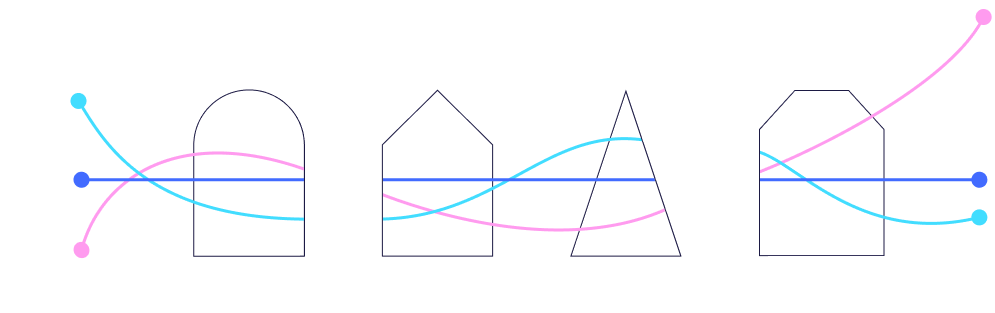

<p align="center">
  
</p>

# powdr

[](https://matrix.to/#/#powdr:matrix.org)
[](https://twitter.com/powdr_labs)<!-- markdown-link-check-disable-line -->

> WARNING: This codebase is experimental and has not been audited. DO NOT USE FOR PRODUCTION!

If you have any questions or want to contribute, feel free to write us in our [Matrix Chat](https://matrix.to/#/#powdr:matrix.org).

*powdr* provides state-of-the-art performance and security to zkVMs, enhancing them with compiler-based techniques including static analysis and formal verification.

The main components are:

- [Autoprecompiles](https://www.powdr.org/blog/auto-acc-circuits): automated synthesis of guest-specific precompiles.
- Constraint Solver: compile-time solver used to detect potential optimizations and security issues.
- powdr-OpenVM: powdr extensions for [OpenVM](https://github.com/openvm-org/openvm/).

## powdr-legacy

The previous versions of powdr are now archived in the [powdr-legacy](https://github.com/powdr-labs/powdr-legacy) repository.
It contains all previous crates regarding provers, powdr-asm, powdr-pil, powdrVM, stdlib circuits and RISC-V support.

### Project structure

For an overview of the project structure, run:

```
cargo doc --workspace --no-deps --open
```

## Contributing

Unless you explicitly state otherwise, any contribution intentionally submitted
for inclusion in the work by you, as defined in the Apache-2.0 license, shall be
dual licensed as below, without any additional terms or conditions.

## License

This project is licensed under either of

<!-- markdown-link-check-disable -->
- [Apache License, Version 2.0](https://www.apache.org/licenses/LICENSE-2.0) ([`LICENSE-APACHE`](LICENSE-APACHE))
- [MIT license](https://opensource.org/licenses/MIT) ([`LICENSE-MIT`](LICENSE-MIT))
<!-- markdown-link-check-enable -->

at your option.
