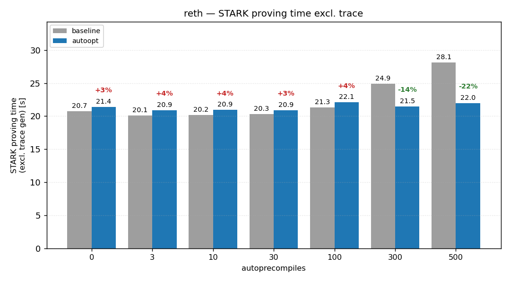
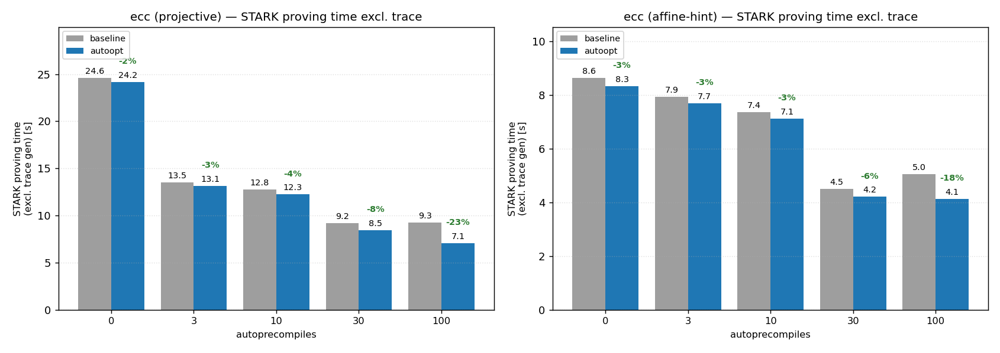
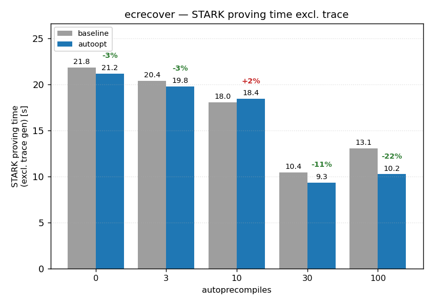
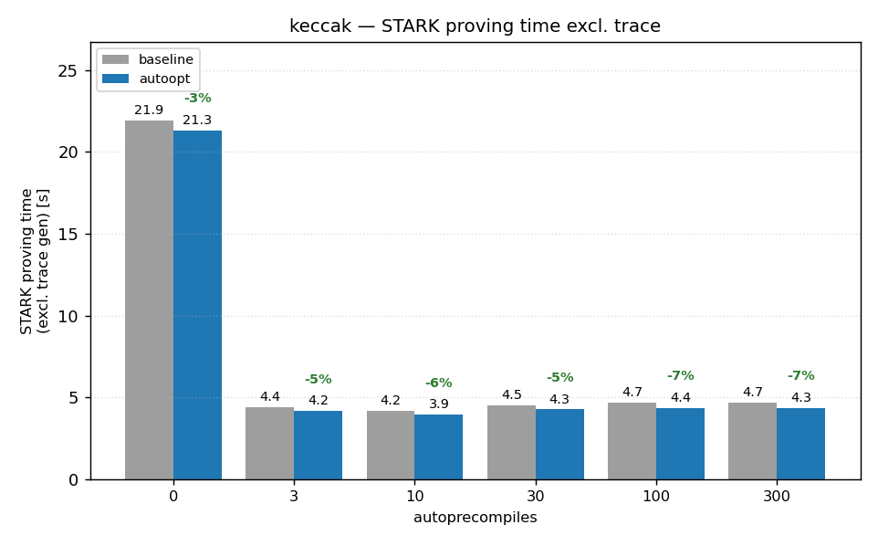
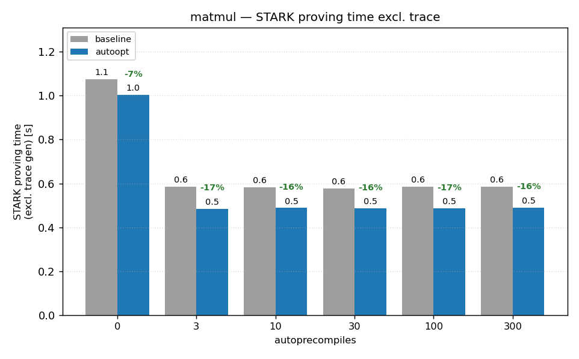
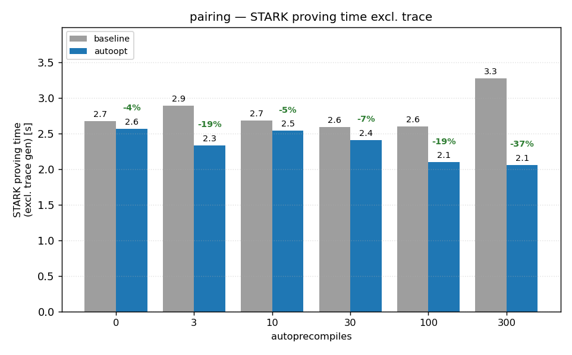
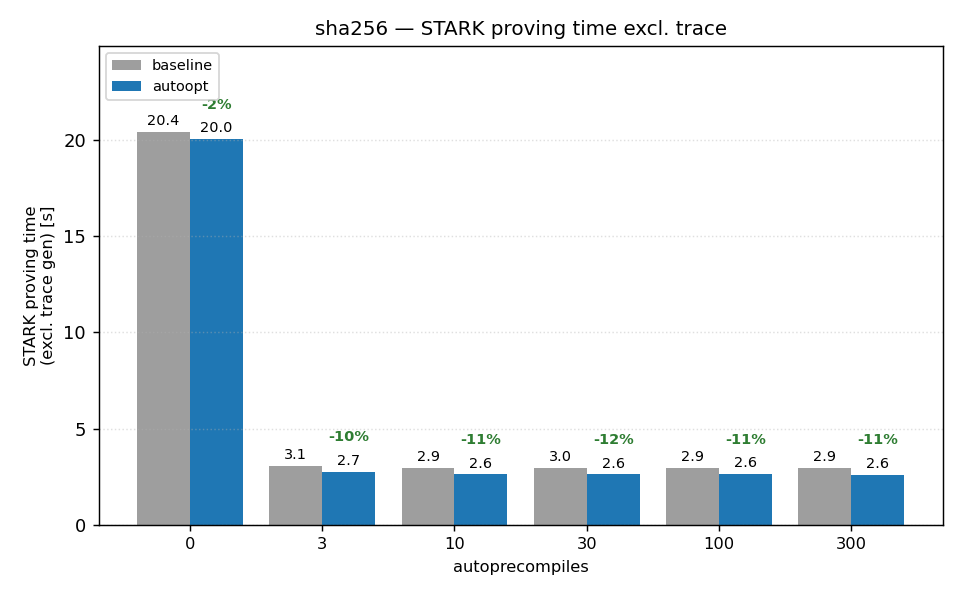
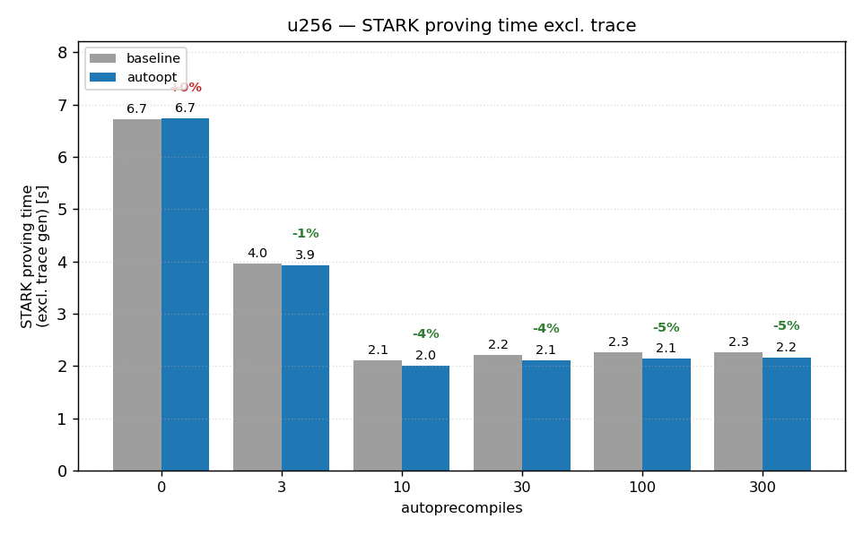

# Bench results — 2026-06-03, CUDA (RTX 4090), autoopt GPU prover

Same experiments as [`bench-results/`](../bench-results/readme.md) (all guests
swept over {0, 3, 10, 30, 100, 300} APCs at ~50-software-segment workloads,
reth at mainnet block 24171377 over {0, …, 1000}), but with the **autoopt GPU
prover**: powdr-labs/stark-backend branch
[`autoopt-2026-04-12-clean`](https://github.com/powdr-labs/stark-backend/tree/autoopt-2026-04-12-clean)
(multi-stream Round 0 / GKR input eval across CUDA streams, batched MLE-round
and stacking-scatter kernels, batched stacked-reduction sync, pre-allocated
per-thread GPU buffers, GPU-side Round 0 polynomial extraction). The branch
was already based on the pinned `v2.0.0-beta.2-powdr` (8d36ad2), so no rebase
was needed; its "Remove ColumnsAir" commit is reverted on top so the pinned
openvm fork still compiles. Exact code:
[`autoopt-beta2-compat`](https://github.com/powdr-labs/stark-backend/tree/autoopt-beta2-compat)
@ `4f3755ce7ea5e2940c313b3053c0de44feaf7847`.

**ecc**: 📂 [Raw data](https://github.com/powdr-labs/powdr/tree/bench-cuda-apc-sweep-2026-06/bench-results-autoopt/ecc) &nbsp;|&nbsp; 📊 [Metrics Viewer](https://powdr-labs.github.io/powdr/openvm/metrics-viewer/?data=https%3A%2F%2Fgithub.com%2Fpowdr-labs%2Fpowdr%2Fblob%2Fbench-cuda-apc-sweep-2026-06%2Fbench-results-autoopt%2Fecc%2Fcombined_metrics.json) &nbsp;|&nbsp; 🔍 [APC Analyzer](https://powdr-labs.github.io/powdr/autoprecompile-analyzer/?data=https%3A%2F%2Fgithub.com%2Fpowdr-labs%2Fpowdr%2Fblob%2Fbench-cuda-apc-sweep-2026-06%2Fbench-results-autoopt%2Fecc%2Fcandidates%2Fguest-ecc-powdr-affine-hint-input100%2Fapc_candidates.json)

**ecrecover**: 📂 [Raw data](https://github.com/powdr-labs/powdr/tree/bench-cuda-apc-sweep-2026-06/bench-results-autoopt/ecrecover) &nbsp;|&nbsp; 📊 [Metrics Viewer](https://powdr-labs.github.io/powdr/openvm/metrics-viewer/?data=https%3A%2F%2Fgithub.com%2Fpowdr-labs%2Fpowdr%2Fblob%2Fbench-cuda-apc-sweep-2026-06%2Fbench-results-autoopt%2Fecrecover%2Fcombined_metrics.json) &nbsp;|&nbsp; 🔍 [APC Analyzer](https://powdr-labs.github.io/powdr/autoprecompile-analyzer/?data=https%3A%2F%2Fgithub.com%2Fpowdr-labs%2Fpowdr%2Fblob%2Fbench-cuda-apc-sweep-2026-06%2Fbench-results-autoopt%2Fecrecover%2Fcandidates%2Fguest-ecrecover-input125%2Fapc_candidates.json)

**keccak**: 📂 [Raw data](https://github.com/powdr-labs/powdr/tree/bench-cuda-apc-sweep-2026-06/bench-results-autoopt/keccak) &nbsp;|&nbsp; 📊 [Metrics Viewer](https://powdr-labs.github.io/powdr/openvm/metrics-viewer/?data=https%3A%2F%2Fgithub.com%2Fpowdr-labs%2Fpowdr%2Fblob%2Fbench-cuda-apc-sweep-2026-06%2Fbench-results-autoopt%2Fkeccak%2Fcombined_metrics.json) &nbsp;|&nbsp; 🔍 [APC Analyzer](https://powdr-labs.github.io/powdr/autoprecompile-analyzer/?data=https%3A%2F%2Fgithub.com%2Fpowdr-labs%2Fpowdr%2Fblob%2Fbench-cuda-apc-sweep-2026-06%2Fbench-results-autoopt%2Fkeccak%2Fcandidates%2Fguest-keccak-input25000%2Fapc_candidates.json)

**matmul**: 📂 [Raw data](https://github.com/powdr-labs/powdr/tree/bench-cuda-apc-sweep-2026-06/bench-results-autoopt/matmul) &nbsp;|&nbsp; 📊 [Metrics Viewer](https://powdr-labs.github.io/powdr/openvm/metrics-viewer/?data=https%3A%2F%2Fgithub.com%2Fpowdr-labs%2Fpowdr%2Fblob%2Fbench-cuda-apc-sweep-2026-06%2Fbench-results-autoopt%2Fmatmul%2Fcombined_metrics.json) &nbsp;|&nbsp; 🔍 [APC Analyzer](https://powdr-labs.github.io/powdr/autoprecompile-analyzer/?data=https%3A%2F%2Fgithub.com%2Fpowdr-labs%2Fpowdr%2Fblob%2Fbench-cuda-apc-sweep-2026-06%2Fbench-results-autoopt%2Fmatmul%2Fcandidates%2Fguest-matmul-input0%2Fapc_candidates.json)

**pairing**: 📂 [Raw data](https://github.com/powdr-labs/powdr/tree/bench-cuda-apc-sweep-2026-06/bench-results-autoopt/pairing) &nbsp;|&nbsp; 📊 [Metrics Viewer](https://powdr-labs.github.io/powdr/openvm/metrics-viewer/?data=https%3A%2F%2Fgithub.com%2Fpowdr-labs%2Fpowdr%2Fblob%2Fbench-cuda-apc-sweep-2026-06%2Fbench-results-autoopt%2Fpairing%2Fcombined_metrics.json) &nbsp;|&nbsp; 🔍 [APC Analyzer](https://powdr-labs.github.io/powdr/autoprecompile-analyzer/?data=https%3A%2F%2Fgithub.com%2Fpowdr-labs%2Fpowdr%2Fblob%2Fbench-cuda-apc-sweep-2026-06%2Fbench-results-autoopt%2Fpairing%2Fcandidates%2Fguest-pairing-input0%2Fapc_candidates.json)

**reth_gpu**: 📂 [Raw data](https://github.com/powdr-labs/powdr/tree/bench-cuda-apc-sweep-2026-06/bench-results-autoopt/reth_gpu) &nbsp;|&nbsp; 📊 [Metrics Viewer](https://powdr-labs.github.io/powdr/openvm/metrics-viewer/?data=https%3A%2F%2Fgithub.com%2Fpowdr-labs%2Fpowdr%2Fblob%2Fbench-cuda-apc-sweep-2026-06%2Fbench-results-autoopt%2Freth_gpu%2Fcombined_metrics.json) &nbsp;|&nbsp; 🔍 [APC Analyzer](https://powdr-labs.github.io/powdr/autoprecompile-analyzer/?data=https%3A%2F%2Fgithub.com%2Fpowdr-labs%2Fpowdr%2Fblob%2Fbench-cuda-apc-sweep-2026-06%2Fbench-results-autoopt%2Freth_gpu%2Fapc_candidates.json)

**sha256**: 📂 [Raw data](https://github.com/powdr-labs/powdr/tree/bench-cuda-apc-sweep-2026-06/bench-results-autoopt/sha256) &nbsp;|&nbsp; 📊 [Metrics Viewer](https://powdr-labs.github.io/powdr/openvm/metrics-viewer/?data=https%3A%2F%2Fgithub.com%2Fpowdr-labs%2Fpowdr%2Fblob%2Fbench-cuda-apc-sweep-2026-06%2Fbench-results-autoopt%2Fsha256%2Fcombined_metrics.json) &nbsp;|&nbsp; 🔍 [APC Analyzer](https://powdr-labs.github.io/powdr/autoprecompile-analyzer/?data=https%3A%2F%2Fgithub.com%2Fpowdr-labs%2Fpowdr%2Fblob%2Fbench-cuda-apc-sweep-2026-06%2Fbench-results-autoopt%2Fsha256%2Fcandidates%2Fguest-sha256-input80000%2Fapc_candidates.json)

**u256**: 📂 [Raw data](https://github.com/powdr-labs/powdr/tree/bench-cuda-apc-sweep-2026-06/bench-results-autoopt/u256) &nbsp;|&nbsp; 📊 [Metrics Viewer](https://powdr-labs.github.io/powdr/openvm/metrics-viewer/?data=https%3A%2F%2Fgithub.com%2Fpowdr-labs%2Fpowdr%2Fblob%2Fbench-cuda-apc-sweep-2026-06%2Fbench-results-autoopt%2Fu256%2Fcombined_metrics.json) &nbsp;|&nbsp; 🔍 [APC Analyzer](https://powdr-labs.github.io/powdr/autoprecompile-analyzer/?data=https%3A%2F%2Fgithub.com%2Fpowdr-labs%2Fpowdr%2Fblob%2Fbench-cuda-apc-sweep-2026-06%2Fbench-results-autoopt%2Fu256%2Fcandidates%2Fguest-u256-input0%2Fapc_candidates.json)

## reth vs. baseline

| APCs | segments | baseline total | autoopt total | baseline proving¹ | autoopt proving¹ | Δ proving |
|---|---|---|---|---|---|---|
| 0 | 44 | 33.7 s | 34.5 s | 20.7 s | 21.4 s | +3% |
| 3 | 43 | 33.2 s | 34.1 s | 20.1 s | 20.9 s | +4% |
| 10 | 42 | 33.4 s | 34.2 s | 20.2 s | 20.9 s | +4% |
| 30 | 42 | 33.9 s | 34.5 s | 20.3 s | 20.9 s | +3% |
| 100 | 40 | 36.2 s | 36.9 s | 21.3 s | 22.1 s | +4% |
| 300 | 37 | 42.1 s | 39.3 s | 24.9 s | 21.5 s | **−14%** |
| 500 ² | 35 | 46.9 s | 41.4 s | 28.1 s | 22.0 s | **−22%** |

¹ `total_proof_time_excluding_trace_ms`. ² with
`--leaf-log-stacked-height 22 --internal-log-stacked-height 20` (both provers).

The optimizations target per-AIR overheads, and that is exactly what the sweep
shows: the baseline prover's proving time climbs +36 % from 0 to 500 APCs
(20.7 s → 28.1 s) while the autoopt prover stays **flat** (21.4 s → 22.0 s,
+3 %) — the "more APCs make reth proving slower on GPU" effect from the
baseline run is gone in proving time. At ≤100 APCs (few powdr AIRs,
base-chip-dominated segments) autoopt is a consistent ~3–4 % *slower*,
presumably the cost of the multi-stream/batching infrastructure on segments
where there is little to batch. Totals still rise with APC count in both
provers because trace generation and the interpreted preflight are unchanged.

The APC-count **limit is unchanged**: ≤300 with default aggregation params,
500 with the raised caps (peak GPU memory 20.1 GiB), and 750/1000 still die in
leaf aggregation — 750 needs a 2^23-row stacked leaf (`LayoutHeightExceeded`)
and proving one OOMs the 24 GiB card at 1000 even though the app proof itself
completes (`reth_gpu/failed_runs.txt`).

## Guests vs. baseline (at each guest's best autoopt APC count)

| guest | best count | baseline total | autoopt total | baseline proving¹ | autoopt proving¹ | Δ proving |
|---|---|---|---|---|---|---|
| keccak | 10 | 21.8 s | 21.6 s | 4.2 s | 3.9 s | −6% |
| sha256 | 300 | 17.9 s | 17.5 s | 2.9 s | 2.6 s | −11% |
| u256 | 10 | 7.2 s | 7.1 s | 2.1 s | 2.0 s | −4% |
| matmul | 3 | 1.3 s | 1.1 s | 0.6 s | 0.5 s | −17% |
| pairing | 3 | 5.5 s | 4.7 s | 2.9 s | 2.3 s | −19% |
| ecc (projective) | 100 | 32.0 s | 31.0 s | 9.3 s | 7.1 s | −23% |
| ecc (affine-hint) | 30 | 13.4 s | 13.1 s | 4.5 s | 4.2 s | −6% |
| ecrecover | 30 | 33.7 s | 32.8 s | 10.4 s | 9.3 s | −11% |

Across the full guest sweeps the proving-time delta grows with APC count
(e.g. pairing@300 −37 %, ecc-projective@100 −23 %, sha256 −11 % at every
count ≥3), matching the per-AIR-overhead explanation. The same three runs
fail as in the baseline (`guest-ecc-projective`, `guest-ecc-powdr-affine-hint`
and `guest-ecrecover` at 300 APCs, `LayoutHeightExceeded { 22 > 21 }`).

## STARK proving-time charts — autoopt vs. baseline

One chart per experiment (matching the metrics-viewer links above): x-axis =
number of autoprecompiles, two bars per count — baseline (gray) vs. autoopt
(blue) — y-axis = STARK proving time **excluding trace generation**
(`total_proof_time_excluding_trace_ms`), in seconds. The green/red label over
the autoopt bar is its % delta vs. baseline (green = faster). ecc carries both
its variants (projective, affine-hint) under one metrics link, so its chart has
one subplot per variant.

**reth** — baseline climbs with APC count, autoopt stays flat (−14 % at 300, −22 % at 500):



**ecc**



**ecrecover**



**keccak**



**matmul**



**pairing**



**sha256**



**u256**



Regenerate with
`python openvm-riscv/scripts/plot_autoopt_comparison.py bench-results bench-results-autoopt bench-results-autoopt/charts`.

## How to reproduce

On top of the [`bench-results/` setup](../bench-results/readme.md) (same
toolchains, env and scripts):

```sh
# 1. The autoopt stark-backend, as a sibling of the powdr checkout:
git clone https://github.com/powdr-labs/stark-backend.git ../stark-backend-autoopt
git -C ../stark-backend-autoopt checkout autoopt-beta2-compat   # 4f3755ce

# 2. Point powdr at it (adds a [patch] section to Cargo.toml):
git apply openvm-riscv/scripts/powdr-stark-backend-autoopt.patch

# 3. Guest benchmarks, exactly as for bench-results/:
export POWDR_OPENVM_SEGMENT_DELTA=50000
BENCH_FEATURES=metrics,cuda BENCH_KEEP_GOING=1 ./openvm-riscv/scripts/run_guest_benches.sh

# 4. openvm-eth: after the one-time setup from bench-results/readme.md
#    (clone at the pinned ref + openvm-eth-bench.patch + RPC_1), point it at
#    the autoopt checkout too:
git -C openvm-eth apply ../openvm-riscv/scripts/openvm-eth-stark-backend-autoopt.patch
cat >> openvm-eth/.cargo/config.toml <<'TOML'

[patch."https://github.com/powdr-labs/stark-backend.git"]
openvm-stark-sdk = { path = "../../stark-backend-autoopt/crates/stark-sdk" }
openvm-stark-backend = { path = "../../stark-backend-autoopt/crates/stark-backend" }
openvm-codec-derive = { path = "../../stark-backend-autoopt/crates/stark-backend/codec-derive" }
openvm-cuda-backend = { path = "../../stark-backend-autoopt/crates/cuda-backend" }
openvm-cuda-builder = { path = "../../stark-backend-autoopt/crates/cuda-builder" }
openvm-cuda-common = { path = "../../stark-backend-autoopt/crates/cuda-common" }
openvm-cpu-backend = { path = "../../stark-backend-autoopt/crates/cpu-backend" }
TOML

# 5. Reth sweep + the >300 retries, exactly as for bench-results/:
./openvm-riscv/scripts/run_reth_gpu_bench.sh
cd openvm-eth
./run.sh --cuda --block 24171377 --apc 500  --leaf-log-stacked-height 22 --internal-log-stacked-height 20 --mode prove-stark
./run.sh --cuda --block 24171377 --apc 750  --leaf-log-stacked-height 22 --internal-log-stacked-height 21 --mode prove-stark  # fails: LayoutHeightExceeded(23 > 22)
./run.sh --cuda --block 24171377 --apc 1000 --leaf-log-stacked-height 23 --internal-log-stacked-height 21 --mode prove-stark  # fails: CUDA OOM in leaf agg
cd ..

# 6. Collect:
./openvm-riscv/scripts/collect_bench_results.sh results bench-results-autoopt
```

Notes: `run_reth_gpu_bench.sh` only writes the powdr [patch] section into
`openvm-eth/.cargo/config.toml` when it is missing, so the stark-backend
section above survives reruns. Hardware/software environment is identical to
[`bench-results/readme.md`](../bench-results/readme.md); the powdr working
tree is the same branch with only the [patch] overlay applied.
